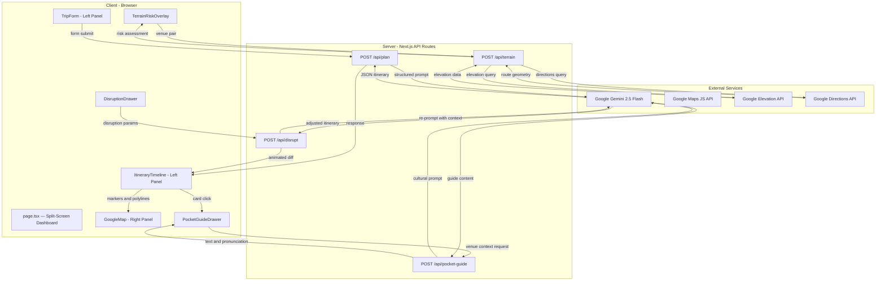

# Aetheria — Specification Document

> **Version:** 1.0  
> **Last Updated:** 2026-05-08  
> **Status:** Awaiting Review

---

## 1. Product Overview

**Aetheria** is a premium, AI-powered travel planning and experience engine. Users provide trip constraints (destination, dates, budget, interests, accessibility needs) and receive a fully structured, time-blocked itinerary — rendered as an interactive split-screen dashboard with a live map.

Three differentiating features elevate Aetheria beyond a standard trip planner:

| # | Feature | Summary |
|---|---------|---------|
| 1 | **Disruption Engine Simulator** | A slide-out drawer that lets users inject real-time disruptions (weather, delays, closures). The system re-prompts Gemini, and the itinerary re-animates with shifted timelines. |
| 2 | **Terrain Risk Profiler** | Evaluates walking routes between venues for elevation, slope, and surface type. Flags risks for mobility-constrained users and suggests flatter alternatives. |
| 3 | **Pocket Guide Drawer** | A persistent overlay that provides cultural context, local etiquette, and spoken pronunciation tips (Web Speech Synthesis API) for the selected venue. |

---

## 2. Technology Stack

| Layer | Technology | Version |
|-------|-----------|---------|
| Framework | Next.js (App Router) | 16.2.6 |
| Language | TypeScript | ^5 |
| UI | React + Tailwind CSS v4 | React 19.2, TW 4 |
| Icons | Lucide React | ^1.14 |
| AI Backend | `@google/genai` (Gemini 2.5 Flash) | ^2.0 |
| Maps | `@googlemaps/js-api-loader` | ^2.0.2 |
| Speech | Web Speech Synthesis API | Native |
| Effects | canvas-confetti | ^1.9 |
| Testing | Vitest + React Testing Library | ^4.1 |

---

## 3. Architecture Overview



---

## 4. TypeScript Schema Design - `src/types/itinerary.ts`

### 4.1 Core Types

```typescript
/** Geographic coordinate pair */
export interface LatLng {
  lat: number;
  lng: number;
}

/** A single activity/venue within the itinerary */
export interface Activity {
  id: string;
  name: string;
  category: ActivityCategory;
  location: LatLng;
  address: string;
  startTime: string;        // ISO 8601 time "09:00"
  endTime: string;           // ISO 8601 time "10:30"
  durationMinutes: number;
  description: string;
  estimatedCost: CostEstimate;
  transitFromPrevious: TransitSegment | null;
  accessibilityInfo: AccessibilityInfo;
  culturalNotes: string[];
  imageQuery: string;        // search term for venue image
  tags: string[];
}

export type ActivityCategory =
  | 'landmark'
  | 'museum'
  | 'restaurant'
  | 'cafe'
  | 'nature'
  | 'shopping'
  | 'nightlife'
  | 'cultural'
  | 'adventure'
  | 'wellness'
  | 'transit';

export interface CostEstimate {
  amount: number;
  currency: string;          // ISO 4217 code
  tier: 'free' | 'budget' | 'moderate' | 'premium';
}

export interface TransitSegment {
  mode: 'walk' | 'drive' | 'transit' | 'cycle' | 'taxi';
  durationMinutes: number;
  distanceKm: number;
  routePolyline?: string;    // encoded polyline from Directions API
}

export interface AccessibilityInfo {
  wheelchairAccessible: boolean;
  mobilityRating: 1 | 2 | 3 | 4 | 5;  // 1=easy, 5=challenging
  notes: string;
}
```

### 4.2 Day and Itinerary

```typescript
/** A single day within the itinerary */
export interface ItineraryDay {
  dayNumber: number;
  date: string;              // ISO 8601 date "2026-05-15"
  theme: string;             // e.g. "Historic Heart of Rome"
  activities: Activity[];
  totalCost: CostEstimate;
  weatherForecast?: WeatherSnapshot;
}

export interface WeatherSnapshot {
  condition: string;         // "Sunny", "Heavy Rainfall", etc.
  tempCelsius: number;
  humidity: number;
  icon: string;              // weather icon identifier
}

/** Root itinerary response from the AI */
export interface Itinerary {
  id: string;
  destination: string;
  country: string;
  tripTitle: string;
  startDate: string;
  endDate: string;
  totalDays: number;
  travelerProfile: TravelerProfile;
  days: ItineraryDay[];
  totalEstimatedCost: CostEstimate;
  emergencyContacts: EmergencyContact[];
  packingSuggestions: string[];
  localPhrases: LocalPhrase[];
}
```

### 4.3 User Input and Profile

```typescript
export interface TripRequest {
  destination: string;
  startDate: string;
  endDate: string;
  budget: BudgetLevel;
  interests: string[];
  accessibilityNeeds: AccessibilityNeeds;
  groupSize: number;
  specialRequirements?: string;
}

export type BudgetLevel = 'budget' | 'moderate' | 'luxury';

export interface AccessibilityNeeds {
  wheelchairRequired: boolean;
  limitedMobility: boolean;
  visualImpairment: boolean;
  hearingImpairment: boolean;
  elderlyTraveler: boolean;
  notes?: string;
}

export interface TravelerProfile {
  groupSize: number;
  budget: BudgetLevel;
  interests: string[];
  accessibilityNeeds: AccessibilityNeeds;
}
```

### 4.4 Disruption Engine Types

```typescript
export type DisruptionType =
  | 'weather_severe'
  | 'flight_delayed'
  | 'venue_closed'
  | 'transit_strike'
  | 'road_closure'
  | 'medical_emergency'
  | 'custom';

export interface DisruptionEvent {
  id: string;
  type: DisruptionType;
  label: string;             // "Heavy Rainfall"
  severity: 'low' | 'medium' | 'high' | 'critical';
  affectedDayNumber: number;
  affectedTimeRange?: { start: string; end: string };
  description: string;
}

export interface DisruptionResponse {
  originalItinerary: Itinerary;
  adjustedItinerary: Itinerary;
  changesApplied: ChangeRecord[];
  reasoning: string;
}

export interface ChangeRecord {
  dayNumber: number;
  activityId: string;
  changeType: 'rescheduled' | 'replaced' | 'removed' | 'added';
  before: Partial<Activity> | null;
  after: Partial<Activity> | null;
  reason: string;
}
```

### 4.5 Terrain and Pocket Guide

```typescript
export interface TerrainAssessment {
  fromActivity: string;      // activity ID
  toActivity: string;
  elevationProfile: ElevationPoint[];
  maxSlopePercent: number;
  averageSlopePercent: number;
  surfaceType: 'paved' | 'cobblestone' | 'gravel' | 'mixed' | 'unknown';
  riskLevel: 'safe' | 'moderate' | 'challenging' | 'inaccessible';
  warnings: string[];
  alternativeRoute?: {
    description: string;
    maxSlopePercent: number;
    riskLevel: string;
    additionalMinutes: number;
  };
}

export interface ElevationPoint {
  location: LatLng;
  elevation: number;         // meters above sea level
  distanceFromStart: number; // meters
}

export interface PocketGuideContent {
  venueName: string;
  culturalContext: string;
  localEtiquette: string[];
  pronunciationTips: PronunciationTip[];
  funFacts: string[];
  photographyTips?: string;
  dressCode?: string;
}

export interface PronunciationTip {
  phrase: string;             // e.g. "Grazie mille"
  meaning: string;           // "Thank you very much"
  phoneticGuide: string;     // "GRAH-tsee-ay MEE-leh"
  language: string;           // BCP 47 language tag
}

export interface LocalPhrase {
  phrase: string;
  meaning: string;
  phoneticGuide: string;
  context: string;
}

export interface EmergencyContact {
  name: string;
  number: string;
  type: 'police' | 'ambulance' | 'embassy' | 'tourist_helpline';
}
```

---

## 5. API Route Design

### 5.1 `POST /api/plan` — Generate Itinerary

| Field | Detail |
|-------|--------|
| **Request Body** | `TripRequest` |
| **Response Body** | `Itinerary` |
| **AI Model** | `gemini-2.5-flash` |
| **Config** | `responseMimeType: 'application/json'`, `responseSchema` matching `Itinerary` type |
| **System Prompt** | Expert travel planner persona with structured output instructions |
| **Security** | Server-only `GEMINI_API_KEY` from `process.env` |
| **Error Handling** | Runtime validation of AI response shape, graceful fallback |

### 5.2 `POST /api/disrupt` — Disruption Re-planning

| Field | Detail |
|-------|--------|
| **Request Body** | `{ itinerary: Itinerary, disruption: DisruptionEvent }` |
| **Response Body** | `DisruptionResponse` |
| **Behavior** | Sends the current itinerary + disruption context to Gemini, receives an adjusted itinerary with a diff of changes |

### 5.3 `POST /api/terrain` — Terrain Risk Assessment

| Field | Detail |
|-------|--------|
| **Request Body** | `{ from: LatLng, to: LatLng, accessibilityNeeds: AccessibilityNeeds }` |
| **Response Body** | `TerrainAssessment` |
| **Behavior** | Queries Google Elevation API along the route path, computes slopes, evaluates risk against user's mobility constraints |

### 5.4 `POST /api/pocket-guide` — Cultural Context

| Field | Detail |
|-------|--------|
| **Request Body** | `{ venueName: string, destination: string, country: string }` |
| **Response Body** | `PocketGuideContent` |
| **Behavior** | Gemini generates cultural context, etiquette, and pronunciation tips for the selected venue |

---

## 6. Component Architecture

### 6.1 Component Tree

```
src/
├── app/
│   ├── layout.tsx              # Root layout: fonts, meta, theme
│   ├── page.tsx                # Split-screen dashboard (Server Component shell)
│   ├── globals.css             # Tailwind + design tokens
│   └── api/
│       ├── plan/route.ts       # Itinerary generation
│       ├── disrupt/route.ts    # Disruption re-planning
│       ├── terrain/route.ts    # Terrain assessment
│       └── pocket-guide/route.ts
├── components/
│   ├── dashboard/
│   │   ├── SplitScreen.tsx     # Main responsive container
│   │   ├── LeftPanel.tsx       # Form + Itinerary timeline
│   │   └── RightPanel.tsx      # Map + overlays
│   ├── trip-form/
│   │   ├── TripForm.tsx        # Multi-step form component
│   │   ├── DatePicker.tsx      # Custom date range selector
│   │   ├── InterestGrid.tsx    # Interest tag grid selector
│   │   └── AccessibilityForm.tsx # Accessibility needs form
│   ├── itinerary/
│   │   ├── ItineraryTimeline.tsx    # Vertical timeline of days
│   │   ├── DayCard.tsx             # Single day container
│   │   ├── ActivityCard.tsx        # Single activity with animations
│   │   └── TransitConnector.tsx    # Transit segment between activities
│   ├── map/
│   │   ├── MapView.tsx         # Google Maps wrapper (client component)
│   │   ├── ActivityMarker.tsx  # Custom map markers
│   │   └── RoutePolyline.tsx   # Route visualization
│   ├── disruption/
│   │   ├── DisruptionDrawer.tsx # Slide-out drawer
│   │   ├── DisruptionCard.tsx  # Preset disruption scenarios
│   │   └── DiffVisualizer.tsx  # Before/after change animation
│   ├── terrain/
│   │   ├── TerrainOverlay.tsx  # Map-integrated overlay
│   │   ├── ElevationChart.tsx  # Elevation profile visualization
│   │   └── RiskBadge.tsx       # Risk level indicator
│   ├── pocket-guide/
│   │   ├── PocketGuideDrawer.tsx   # Persistent overlay drawer
│   │   ├── CulturalCard.tsx        # Cultural context display
│   │   └── PronunciationBtn.tsx    # Speech synthesis trigger
│   └── ui/
│       ├── GlassPanel.tsx      # Reusable glassmorphism container
│       ├── LoadingShimmer.tsx  # Skeleton loading states
│       ├── AnimatedCounter.tsx # Animated number transitions
│       └── IconButton.tsx      # Accessible icon button
├── hooks/
│   ├── useItinerary.ts         # Itinerary state management
│   ├── useDisruption.ts        # Disruption engine state
│   ├── useMap.ts               # Google Maps lifecycle
│   ├── useTerrain.ts           # Terrain assessment fetching
│   ├── usePocketGuide.ts       # Pocket guide state + speech
│   └── useSpeechSynthesis.ts   # Web Speech API wrapper
├── lib/
│   ├── gemini.ts               # Gemini client singleton (server-only)
│   ├── maps.ts                 # Maps loader utility
│   ├── prompts.ts              # All AI prompt templates
│   ├── validators.ts           # Runtime type validation
│   └── constants.ts            # App-wide constants
└── types/
    └── itinerary.ts            # All TypeScript interfaces
```

### 6.2 Key Component Behaviors

#### SplitScreen Dashboard
- **Desktop (>=1024px):** 45% left panel (scrollable), 55% right panel (map, sticky)
- **Tablet (768-1023px):** Stacked with map collapsed to 30vh, expandable
- **Mobile (<768px):** Full-width tabs switching between itinerary and map

#### ActivityCard Interactions
- Click → selects on map (fly-to animation) + opens Pocket Guide drawer
- Hover → highlights marker on map with tooltip
- Disrupted state → red left-border glow + strikethrough animation + replacement slides in

#### DisruptionDrawer
- Slides in from the right edge
- Contains 6 preset disruption types as selectable cards
- "Simulate" button triggers `/api/disrupt` call
- On response, activities animate: change diff with staggered entry/exit animations
- Changed activities pulse with a warm amber glow

---

## 7. Design System

### 7.1 Color Palette

| Token | Value | Usage |
|-------|-------|-------|
| `--bg-base` | `#0d0f12` | App background |
| `--bg-surface` | `rgba(255,255,255,0.05)` | Glass panels |
| `--bg-surface-hover` | `rgba(255,255,255,0.08)` | Hover states |
| `--border-glass` | `rgba(255,255,255,0.10)` | Panel borders |
| `--text-primary` | `#f5f0eb` | Headings, primary text |
| `--text-secondary` | `#a39e97` | Body text, descriptions |
| `--accent-gold` | `#d4a853` | Primary accent, CTAs |
| `--accent-gold-glow` | `rgba(212,168,83,0.3)` | Glow effects |
| `--accent-teal` | `#4ecdc4` | Map routes, links |
| `--status-danger` | `#ff6b6b` | Disruptions, errors |
| `--status-warning` | `#ffd93d` | Terrain warnings |
| `--status-success` | `#6bcb77` | Safe terrain, confirmations |

### 7.2 Typography

- **Font Family:** `Inter` (Google Fonts), fallback `system-ui`
- **Headings:** `font-weight: 700`, `letter-spacing: -0.02em`
- **Body:** `font-weight: 400`, `line-height: 1.6`

### 7.3 Effects

- **Glassmorphism:** `backdrop-blur-md bg-white/5 border border-white/10 rounded-2xl`
- **Card hover:** `transform: translateY(-2px)`, `box-shadow: 0 8px 32px rgba(0,0,0,0.3)`
- **Micro-animations:** All transitions use `cubic-bezier(0.4, 0, 0.2, 1)` with 200-300ms duration
- **Loading states:** Shimmer skeletons with gradient animation

---

## 8. Accessibility Requirements (WCAG 2.1 AA)

| Requirement | Implementation |
|-------------|---------------|
| Keyboard navigation | All interactive elements have `tabIndex`, focus rings visible |
| Screen readers | Semantic HTML (`main`, `nav`, `section`, `article`) + `aria-label` on every button/input |
| Color contrast | All text maintains >=4.5:1 ratio against backgrounds |
| Motion | `prefers-reduced-motion` media query disables animations |
| Focus management | Drawers trap focus when open, return focus on close |
| Alt text | All map markers and icons have descriptive `aria-label` attributes |

---

## 9. Security Model

| Concern | Mitigation |
|---------|-----------|
| API Key exposure | `GEMINI_API_KEY` used only in server-side route handlers (`process.env`) |
| Maps key restriction | `NEXT_PUBLIC_GOOGLE_MAPS_API_KEY` is restricted by HTTP referrer in Google Cloud Console |
| Input validation | All user inputs validated before reaching Gemini prompt |
| Prompt injection | System prompt includes injection guard rails; user input is parameterized, not concatenated |
| Rate limiting | API routes enforce per-IP rate limiting via simple in-memory counter |
| CORS | Next.js API routes are same-origin by default |

---

## 10. Environment Variables

```env
# Server-only (never exposed to browser)
GEMINI_API_KEY=your_gemini_api_key

# Client-accessible (restricted by referrer in Cloud Console)
NEXT_PUBLIC_GOOGLE_MAPS_API_KEY=your_maps_api_key
```
